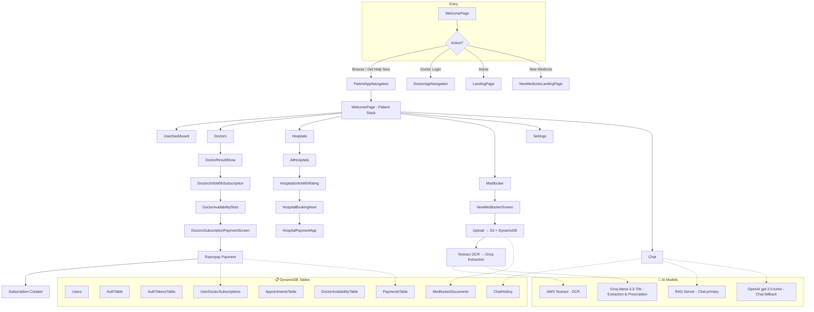
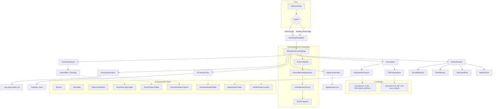
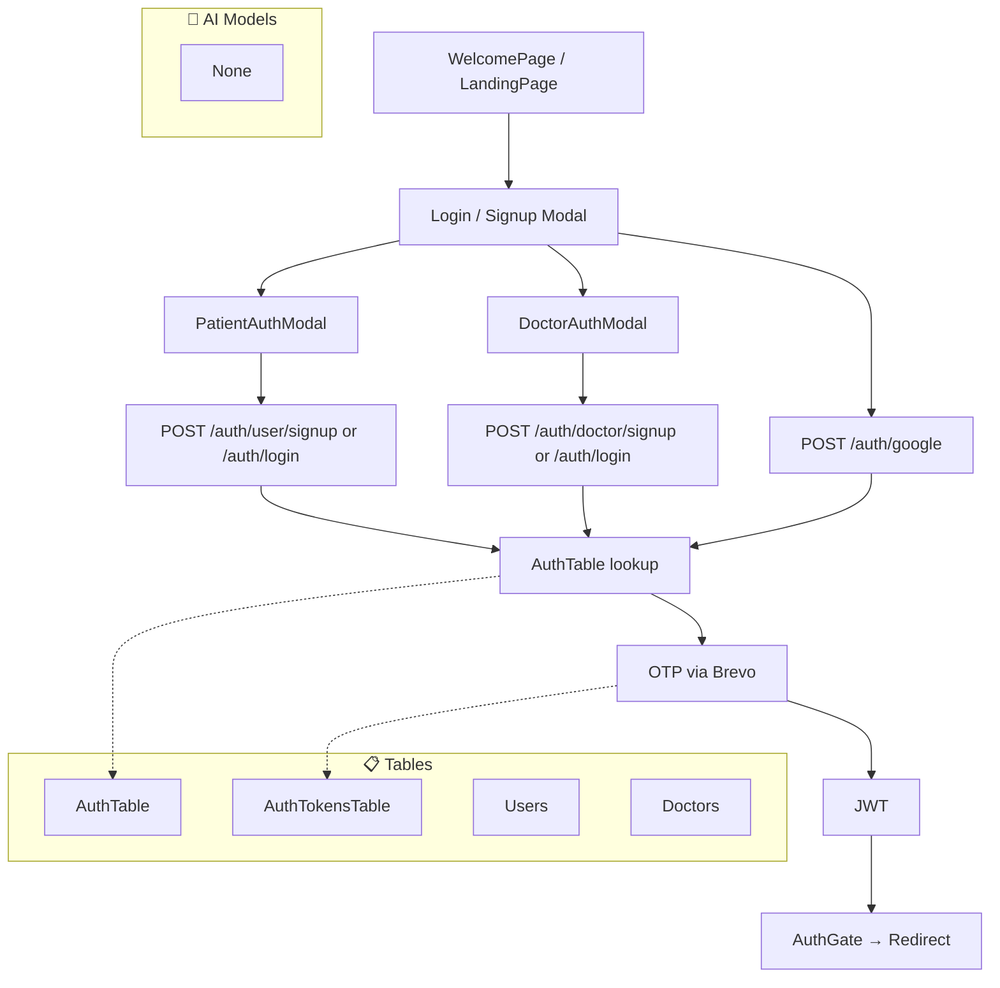
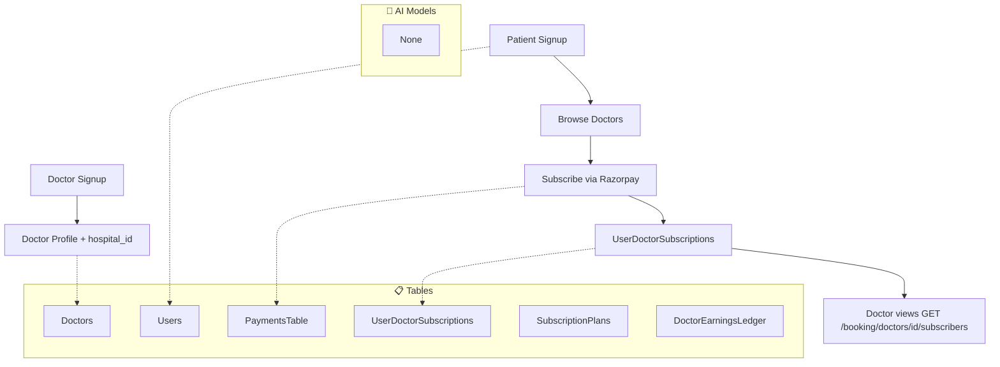
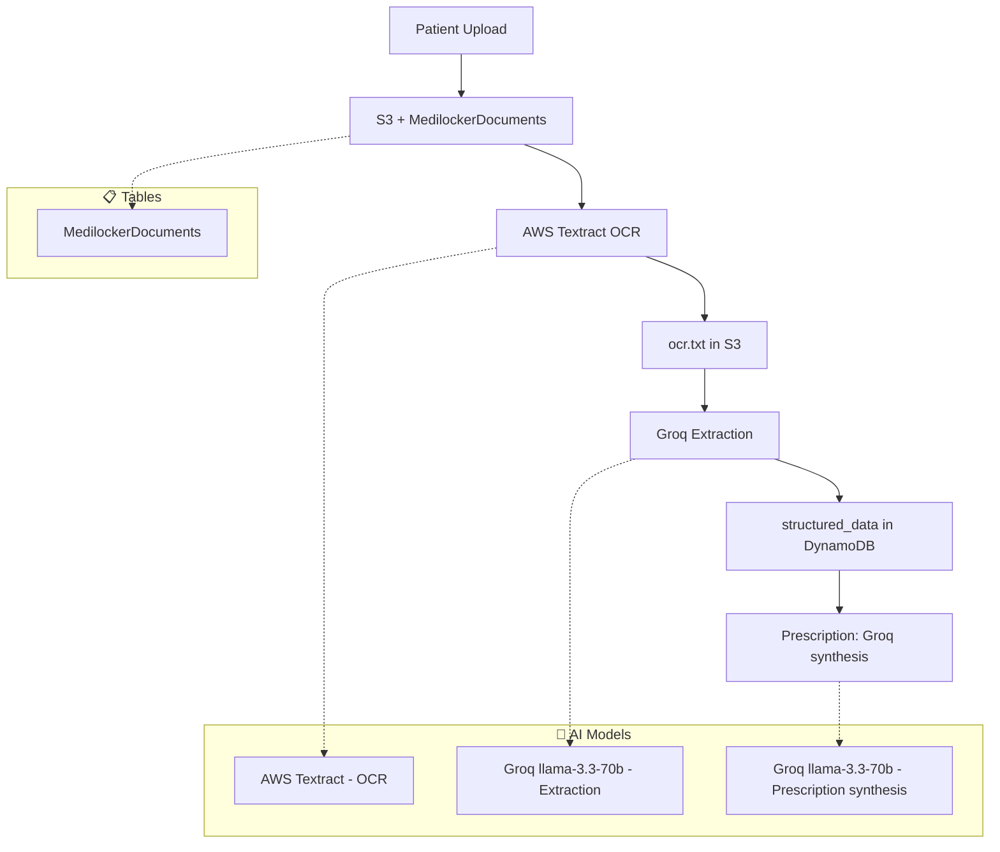
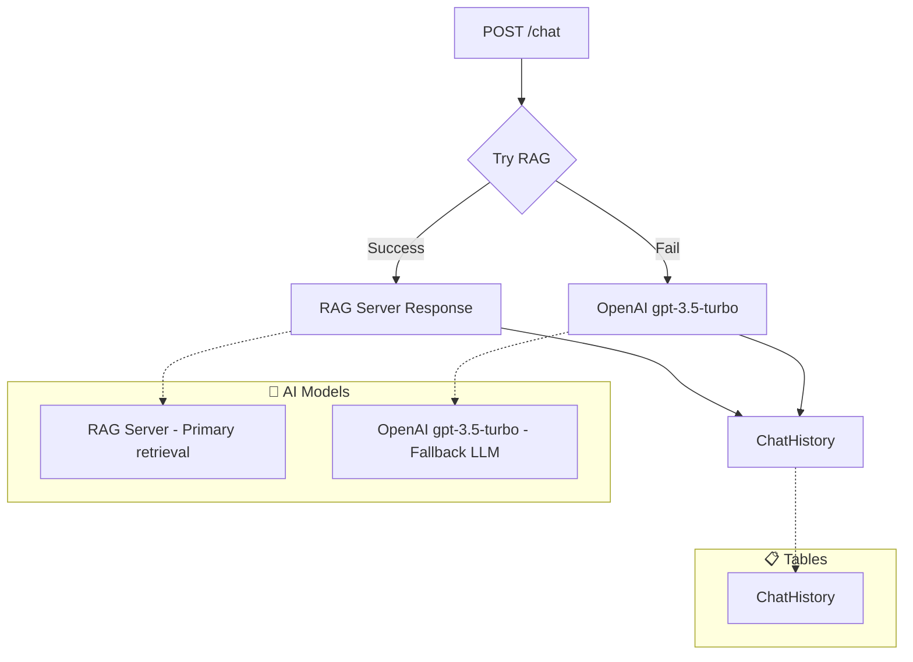

# Kokoro Doctor — Application Flow Diagram

> **Document Purpose:** Maps the starting point, user journeys, and data models for all roles in the Kokoro Doctor platform.

---

## 1. Starting Point

```
┌─────────────────────────────────────────────────────────────────────────────┐
│                         APPLICATION ENTRY POINT                              │
└─────────────────────────────────────────────────────────────────────────────┘
                                      │
                                      ▼
┌─────────────────────────────────────────────────────────────────────────────┐
│  App.jsx                                                                     │
│  └── AuthProvider → ThemeProvider → ChatbotProvider → RoleProvider           │
│      └── LoginModalProvider → NavigationContainer → RootNavigation          │
└─────────────────────────────────────────────────────────────────────────────┘
                                      │
                                      ▼
┌─────────────────────────────────────────────────────────────────────────────┐
│  RootNavigator (RootNavigator.jsx)                                            │
│  • Determines initial route from: URL path, role, user, or default            │
│  • Default initial route: WelcomePage                                         │
└─────────────────────────────────────────────────────────────────────────────┘
```

### Initial Route Logic

| Condition | Route |
|-----------|-------|
| URL `/doctor*` | DoctorAppNavigation |
| URL `/patient*` | PatientAppNavigation |
| `role === "doctor"` | DoctorAppNavigation |
| `role === "user"` | PatientAppNavigation |
| `user.doctor_id` | DoctorAppNavigation |
| `user.user_id` | PatientAppNavigation |
| **Default** | **WelcomePage** |

---

## 2. Role Overview

| Role | Entity | Login Method | Primary Entry |
|------|--------|--------------|---------------|
| **Patient (user)** | Patient | Phone OTP, Google OAuth | WelcomePage → PatientAppNavigation |
| **Doctor** | Doctor | Phone OTP, Google OAuth | WelcomePage → DoctorAppNavigation |
| **Hospital** | Hospital | API key (hospital_id + api_key) | HeaderLoginSignUp → HospitalAuthModal → HospitalUploadPage |
| **Admin** | Internal | x-admin-api-key / x-admin-key headers | No UI; API-only operations |

---

## 3. Patient (User) Flow

### 3.1 Flow Diagram



### 3.2 Patient Navigation Structure

| Screen | Path | Purpose |
|--------|------|---------|
| WelcomePage | `/` | Landing, role selection |
| LandingPage | `/Home` | Home with auth redirect |
| UserDashboard | `/patient/UserDashboard` | Patient dashboard |
| Doctors | `/patient/Doctors` | Doctor discovery & booking |
| DoctorResultShow | `/patient/Doctors` | Doctor list |
| DoctorsInfoWithSubscription | `/patient/Doctors/DoctorsInfoWithSubscription` | Doctor profile + subscribe |
| DoctorAvailabilitySlots | — | Pick appointment slot |
| DoctorsSubscriptionPaymentScreen | — | Razorpay payment |
| Hospitals | `/patient/Hospitals` | Hospital discovery |
| Medilocker | `/patient/Medilocker` | Medical documents |
| NewMedilockerScreen | — | Upload & view documents |
| Settings, Help, ContactUs | — | Account & support |
| MobileChatbot | — | AI chat overlay |

### 3.3 Patient Models (Backend)

| Lambda | Models |
|--------|--------|
| **AuthLambda** | `SignupOtpRequest`, `LoginOtpRequest`, `LoginRequest`, `UserProfileCreate`, `GoogleAuthRequest` |
| **UserServiceLambda** | User profile (user_id, name, email, phone) |
| **BookingLambda** | `BookSlotRequest`, `BookingResponse`, `SlotAvailabilityResponse`, `CreateSubscriptionRequest`, `SubscriptionResponse` |
| **MediLockerLambda** | `UploadRequest`, `FileUploadModel`, `ClinicalQueryRequest`, `SavePrescriptionRequest` |
| **ChatLambda** | `ChatRequest`, `ChatResponse`, `ChatHistoryMessage` |
| **ProcessPaymentLambda** | Razorpay payment link, webhook |

### 3.4 Patient DynamoDB Tables

| Table | Purpose |
|-------|---------|
| Users | Patient profiles |
| AuthTable | Phone/email → user_id mapping |
| AuthTokensTable | OTP tokens |
| UserDoctorSubscriptions | User–doctor subscriptions |
| AppointmentsTable | Bookings |
| DoctorAvailabilityTable | Slots |
| MedilockerDocuments | Document metadata |
| ChatHistory | Chat logs |
| PaymentsTable | Razorpay payments |

---

## 4. Doctor Flow

### 4.1 Flow Diagram



### 4.2 Doctor Navigation Structure

| Screen | Purpose |
|--------|---------|
| DoctorPortalLandingPage | Doctor dashboard home |
| DoctorDashboard | Overview |
| DoctorsSubscribers | List of subscribers |
| DrCalendarView | Availability calendar |
| AppointmentsView | Appointments list |
| Prescription | Prescription management |
| GeneratePrescription | Create prescription from Medilocker |
| FullCaseAnalysis | Case analysis |
| DoctorSettings | Settings hub |
| AccountSettings, ProfileSetting, SubscriberFees | Profile & fees |
| MedicalProof, NotificationSettings | Documents & notifications |
| DoctorsSignUp | Registration |
| DoctorMedicalRegistration | Medical credentials |
| EstablishmentTiming | Availability setup |
| DoctorCongrats | Onboarding complete |

### 4.3 Doctor Models (Backend)

| Lambda | Models |
|--------|--------|
| **AuthLambda** | `SignupOtpRequest`, `DoctorProfileCreate`, `LoginRequest`, `GoogleAuthRequest` |
| **DoctorsServiceLambda** | Doctor profile (doctor_id, specialization, fees, hospital_id, documents) |
| **BookingLambda** | `SubscriptionPlanCreate`, `SubscriptionPlanResponse`, `SubscriptionPlanUpdate`, slots, subscribers |
| **DoctorPayoutsLambda** | Earnings summary, payout request, payout history |
| **MediLockerLambda** | Prescription generation, clinical query |

### 4.4 Doctor DynamoDB Tables

| Table | Purpose |
|-------|---------|
| Doctors | Doctor profiles |
| AuthTable | Phone/email → doctor_id |
| SubscriptionPlans | Plan definitions |
| UserDoctorSubscriptions | Subscribers |
| DoctorAvailabilityTable | Slots |
| AppointmentsTable | Bookings |
| DoctorEarningsLedger | Earnings |
| DoctorPayoutsTable | Payout requests |

---

## 5. Hospital Flow

### 5.1 Flow Diagram

```mermaid
flowchart TD
    subgraph Entry["Entry"]
        A[HeaderLoginSignUp] --> B[Hospital Sign In]
        B --> C[HospitalAuthModal]
    end

    C --> D{Login Success?}
    D -->|Yes| E[HospitalUploadPage]
    D -->|No| C

    E --> F{Upload Method?}
    F -->|Direct| G[POST /hospital/upload]
    F -->|Presigned| H[POST /hospital/presign-upload]
    H --> I[PUT files to S3]
    I --> J[POST /hospital/confirm-upload]

    G --> K[S3: HospitalData/]
    J --> K
    K --> L[DynamoDB: HospitalFiles]

    subgraph DirectAccess["Direct URL"]
        M[/hospital-upload] --> E
    end

    subgraph Tables["📋 DynamoDB Tables"]
        T1[Hospitals]
        T2[HospitalFiles]
    end

    subgraph AI["🤖 AI Models"]
        A1[None - Storage only, no OCR/AI]
    end

    C -.-> T1
    L -.-> T2
```

### 5.2 Hospital Entry Points

| Entry | Path | Auth |
|-------|------|------|
| Header "Hospital" button | — | HospitalAuthModal (hospital_id + api_key) |
| Direct URL | `/hospital-upload` | None (user enters credentials on page) |
| Post-login redirect | — | Session with hospital_id + api_key |

### 5.3 Hospital Models (Backend)

| Lambda | Models |
|--------|--------|
| **HospitalsLambda** | `HospitalCreate`, `HospitalUpdate`, `HospitalLoginRequest` |
| **MediLockerLambda** | `HospitalUploadRequest`, `HospitalPresignRequest`, `HospitalPresignFileItem`, `HospitalConfirmUploadRequest`, `HospitalConfirmFileItem` |

### 5.4 Hospital DynamoDB Tables

| Table | Purpose |
|-------|---------|
| Hospitals | Hospital metadata (admin-managed) |
| HospitalFiles | Raw file metadata (no OCR) |

### 5.5 Hospital S3 Structure

| Prefix | Purpose |
|--------|---------|
| `HospitalData/{hospital_id}/{patient_id}/{file_id}/` | API upload |
| `hospital_uploads/{hospital_id}/{patient_id}/{file_id}/` | Presigned upload |

---

## 6. Admin Flow

### 6.1 Flow Diagram

```mermaid
flowchart TD
    subgraph Admin["Admin (API-only, no UI)"]
        A[x-admin-api-key] --> B[POST /hospitals]
        A --> C[PUT /hospitals/{id}]
        A --> D[PUT /hospitals/{id}/disable]

        E[x-admin-key] --> F[POST /auth/admin/delete-account]
        E --> G[POST /booking/admin/test-subscription]
        E --> H[PUT /payouts/admin/update-status]
        E --> I[GET /payouts/admin/pending]
    end

    B --> J[Hospitals]
    C --> J
    D --> J
    F --> K[Users / Doctors]
    G --> L[UserDoctorSubscriptions]
    H --> M[DoctorPayoutsTable]
    I --> M

    subgraph Tables["📋 DynamoDB Tables"]
        T1[Hospitals]
        T2[Users]
        T3[Doctors]
        T4[UserDoctorSubscriptions]
        T5[DoctorPayoutsTable]
    end

    subgraph AI["🤖 AI Models"]
        A1[None - Admin operations only]
    end

    J -.-> T1
    K -.-> T2
    K -.-> T3
    L -.-> T4
    M -.-> T5
```

### 6.2 Admin Endpoints

| Endpoint | Header | Purpose |
|----------|--------|---------|
| POST /hospitals | x-admin-api-key | Create hospital |
| PUT /hospitals/{id} | x-admin-api-key | Update hospital |
| PUT /hospitals/{id}/disable | x-admin-api-key | Soft delete hospital |
| POST /auth/admin/delete-account | x-admin-key | Delete user/doctor by phone and/or hospital by ID/contact |
| POST /booking/admin/test-subscription | x-admin-key | Create test subscription |
| PUT /payouts/admin/update-status | x-admin-key | Update payout status |
| GET /payouts/admin/pending | x-admin-key | List pending payouts |

---

## 7. Cross-Role Flows

### 7.1 Authentication Flow (Patient & Doctor)



### 7.2 Doctor–Patient Connection Flow



### 7.3 Medilocker Flow (Patient)



### 7.4 Chat Flow (Patient)



---

## 8. AI Models & Tables Reference

### 8.1 AI Models Used

| Model / Service | Where Used | Purpose |
|-----------------|------------|---------|
| **AWS Textract** | Medilocker upload | OCR - extract text from medical images/PDFs |
| **Groq (llama-3.3-70b-versatile)** | Medilocker extraction | Structured data extraction from OCR text |
| **Groq (llama-3.3-70b-versatile)** | Prescription service | Prescription synthesis from patient data |
| **Groq (llama-3.3-70b-versatile)** | Clinical query / Full case analysis | Answer clinical questions, case analysis |
| **RAG Server** | Chat | Primary - retrieval-augmented chat |
| **OpenAI (gpt-3.5-turbo)** | Chat | Fallback when RAG fails |

### 8.2 DynamoDB Tables by Flow

| Flow | Tables |
|------|--------|
| **Patient** | Users, AuthTable, AuthTokensTable, UserDoctorSubscriptions, AppointmentsTable, DoctorAvailabilityTable, MedilockerDocuments, ChatHistory, PaymentsTable |
| **Doctor** | Doctors, AuthTable, SubscriptionPlans, UserDoctorSubscriptions, DoctorAvailabilityTable, AppointmentsTable, DoctorEarningsLedger, DoctorPayoutsTable, MedilockerDocuments |
| **Hospital** | Hospitals, HospitalFiles |
| **Admin** | Hospitals, Users, Doctors, UserDoctorSubscriptions, DoctorPayoutsTable |

---

## 9. Summary: Models by Role

| Role | Key Backend Models | Key Tables |
|------|-------------------|------------|
| **Patient** | UserProfileCreate, BookSlotRequest, CreateSubscriptionRequest, ChatRequest, FileUploadModel | Users, UserDoctorSubscriptions, AppointmentsTable, MedilockerDocuments, ChatHistory |
| **Doctor** | DoctorProfileCreate, SubscriptionPlanCreate, PayoutRequest | Doctors, SubscriptionPlans, DoctorEarningsLedger, DoctorPayoutsTable |
| **Hospital** | HospitalCreate, HospitalUploadRequest, HospitalPresignRequest, HospitalConfirmUploadRequest | Hospitals, HospitalFiles |
| **Admin** | (Uses same models with admin headers) | Hospitals, Users, Doctors, DoctorPayoutsTable |

---

## 10. Deep Link / URL Map

| URL | Screen |
|-----|--------|
| `/` | WelcomePage |
| `/Home` | LandingPage |
| `/patient` | PatientAppNavigation |
| `/patient/UserDashboard` | UserDashboard |
| `/patient/Medilocker` | Medilocker |
| `/patient/Doctors` | DoctorsList |
| `/patient/Doctors/DoctorsInfoWithSubscription` | DoctorsInfoWithSubscription |
| `/patient/Doctors/DoctorResultShow` | DoctorResultShow |
| `/doctor` | DoctorAppNavigation |
| `/doctor/DoctorPortalLandingPage` | DoctorPortalLandingPage |
| `/hospital-upload` | HospitalUploadPage |
| `/NewMedicinelLandingPage` | NewMedicineLandingPage |
