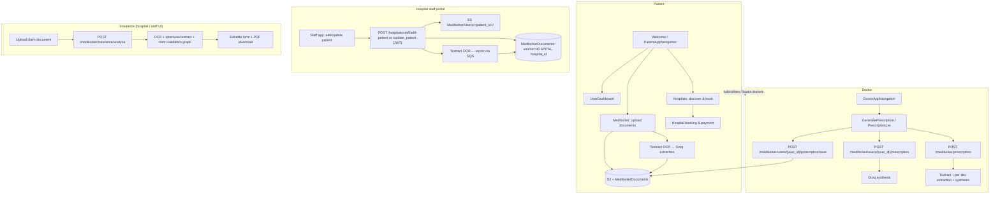
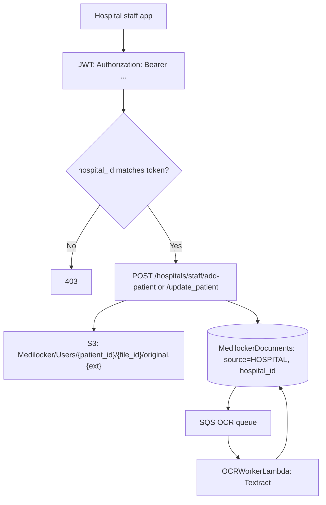
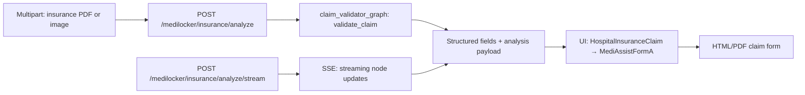
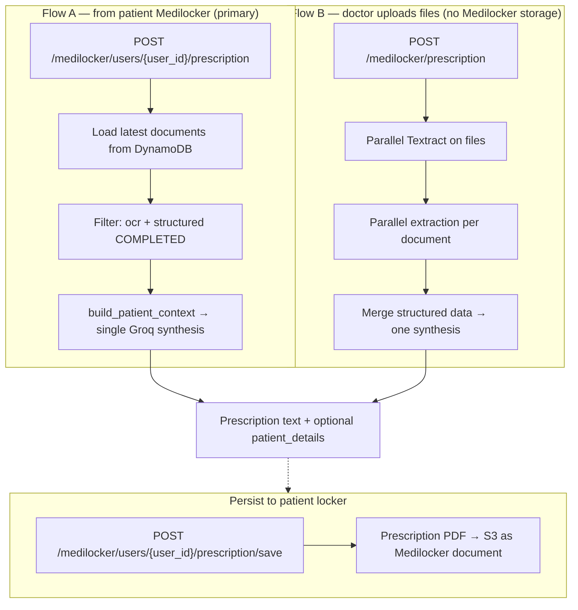
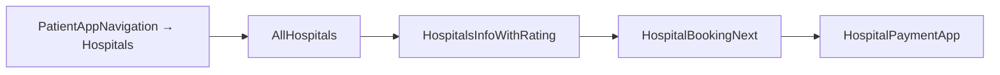
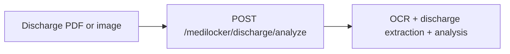

# Hospital, insurance, and prescription flows (Mermaid)

This document ties together **patient ↔ hospital booking**, **hospital patient-document uploads**, **insurance claim analysis**, and **prescription generation** as implemented in Kokoro Doctor. Use any diagram block in Mermaid-compatible viewers (GitHub, Notion, VS Code preview).

---

## 1. End-to-end overview (all roles + AI pipelines)

---

## 2. Hospital: patient document upload (unified with Medilocker)

> The old standalone `/hospital/upload`, `/hospital/presign-upload`,
> `/hospital/confirm-upload` endpoints (medilocker_lambda, API-key auth,
> storage-only into a separate `HospitalFiles` table) have been **removed**.
> Hospital uploads now go through the JWT-secured staff-app routes and land in
> the same `MedilockerDocuments` table patients use, tagged `source=HOSPITAL`.
> See `docs/DOCUMENT_UPLOAD_AND_ACCESS.md` for the full model.

**Access:** `GET /hospitals/staff/patients/{user_id}/documents` returns the
patient's own docs + this hospital's docs only (never another hospital's).

---

## 3. Insurance: analyze claim document (stateless API)

Core pipeline (conceptual): **OCR → structured extraction → claim analysis / validation** (see `insurance_extraction_service` and `claim_validator_graph` in MediLocker Lambda).

---

## 4. Prescription: two paths (stored Medilocker vs ad-hoc upload)

**Related:** `POST /medilocker/users/{user_id}/clinical-query` reuses the same **processed document context** for Q&A (not shown above).

---

## 5. Patient: hospital discovery and booking (app navigation)

This path is **separate** from hospital API-key upload and from Medilocker clinical AI flows; it is the **consumer booking** journey.

---

## 6. Discharge summary analyze (same family as insurance; stateless)

---

## Quick reference

| Area | Main entry | Persistence |
|------|------------|-------------|
| Hospital patient docs | `/hospitals/staff/add-patient`, `/update_patient` (JWT) | `MedilockerDocuments` (source=HOSPITAL) |
| Insurance analyze | `/medilocker/insurance/analyze` | Stateless (optional UI saves elsewhere) |
| Prescription from locker | `/medilocker/users/{user_id}/prescription` | Reads `MedilockerDocuments` |
| Prescription from uploads | `/medilocker/prescription` | Stateless |
| Save prescription PDF | `/medilocker/users/{user_id}/prescription/save` | Writes to Medilocker |

For broader app routing and tables, see `docs/APPLICATION_FLOW_DIAGRAM.md` and `docs/PRESCRIPTION_AND_CASE_ANALYSIS_SYSTEM.md`.
