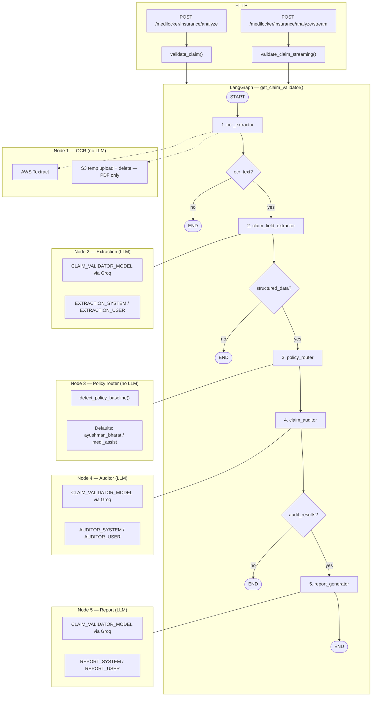
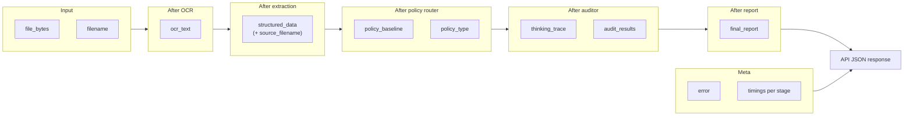
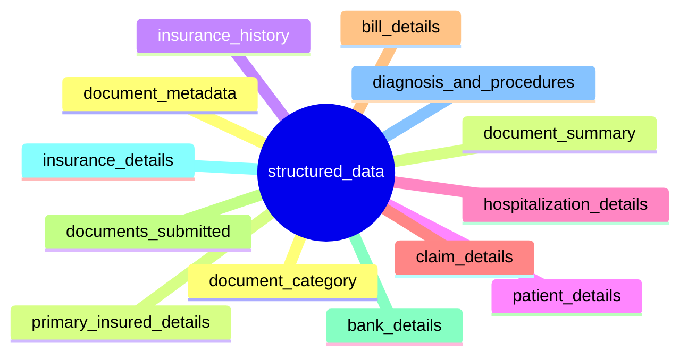
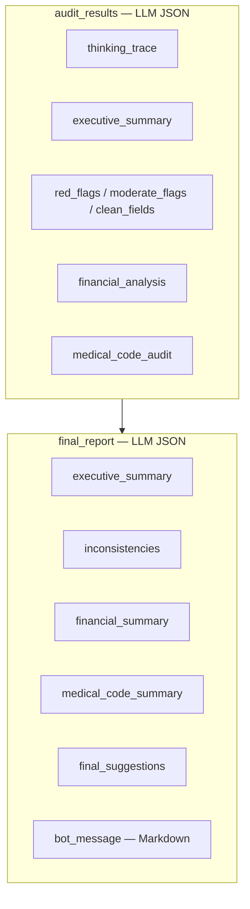
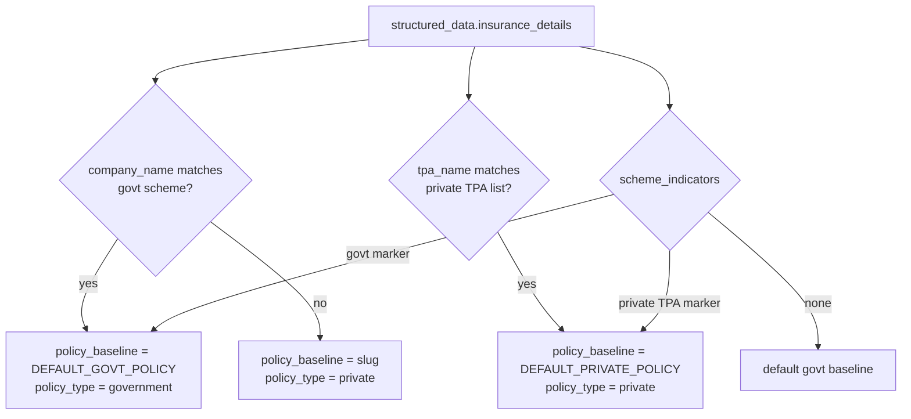

# Insurance claim pipeline — complete flow & models

This document describes the **production** insurance flow used by `POST /medilocker/insurance/analyze` and `/insurance/analyze/stream` in MediLocker Lambda: the **LangGraph** pipeline in `claim_validator_graph.py` (it supersedes the older monolithic path in `insurance_extraction_service.py` for these routes).

---

## Models & external systems

| Layer | Component | Role |
|--------|-----------|------|
| **API** | FastAPI `medilocker_router` | Multipart upload; calls `validate_claim` / `validate_claim_streaming` |
| **Orchestration** | **LangGraph** `StateGraph` | Compiles graph: `build_claim_validator_graph()` → singleton `get_claim_validator()` |
| **State schema** | `ClaimValidationState` (`TypedDict`) | Carries inputs, per-node outputs, `timings`, `error` |
| **OCR** | **AWS Textract** | `extract_text_from_image` (bytes) / `extract_text_from_pdf_s3` (PDF via temp S3 key) |
| **Object storage** | **Amazon S3** | Temp key `{S3_FOLDER_PREFIX}_temp/insurance/{temp_id}/document.{ext}` for PDF OCR; deleted after Textract |
| **LLM** | **Groq** OpenAI-compatible API | `OpenAI(api_key=GROQ_API_KEY, base_url=GROQ_BASE_URL)` |
| **LLM model id** | Env `CLAIM_VALIDATOR_MODEL` | Default: `meta-llama/llama-4-scout-17b-16e-instruct` (`app/config.py`) |
| **Policy routing** | `detect_policy_baseline()` in `policy_router.py` | **No LLM** — rules over `insurance_details` (company, TPA, scheme indicators) vs `GOVT_SCHEME_MARKERS`, `PRIVATE_TPA_MARKERS`, `PRIVATE_INSURER_NAMES`; fallbacks `DEFAULT_GOVT_POLICY` (`ayushman_bharat`), `DEFAULT_PRIVATE_POLICY` (`medi_assist`) |
| **Prompts** | `claim_prompts.py` | `EXTRACTION_*`, `AUDITOR_*`, `REPORT_*` — define JSON shapes for nodes 2, 4, 5 |

---

## Step-by-step pipeline (ordered)

1. **Input** — `file_bytes`, `filename` (allowed: images per `ALLOWED_EXTENSIONS`, plus `pdf`).
2. **Node `ocr_extractor`** — If unsupported extension → `error`, stop. If **PDF**: upload to temp S3 → `extract_text_from_pdf_s3` → delete object. If **image**: `extract_text_from_image`. Empty OCR → `error`, stop.
3. **Node `claim_field_extractor`** — LLM with `EXTRACTION_SYSTEM` / `EXTRACTION_USER` + OCR text, `response_format=json_object` → `structured_data` (+ `source_filename`). Parse failure → `error`, stop.
4. **Node `policy_router`** — `detect_policy_baseline(structured_data)` → `policy_baseline`, `policy_type` (`government` | `private`).
5. **Node `claim_auditor`** — LLM with `AUDITOR_SYSTEM` / `AUDITOR_USER` (injects policy + JSON of `structured_data`) → JSON with `thinking_trace`, `red_flags`, `moderate_flags`, `financial_analysis`, `medical_code_audit`, etc. Failure → `error`, stop.
6. **Node `report_generator`** — LLM with `REPORT_SYSTEM` / `REPORT_USER` (injects `audit_results`) → `final_report` (executive summary, inconsistencies, financial summary, `bot_message`, …).
7. **Output** — `validate_claim` returns: `structured_data`, `policy_baseline`, `policy_type`, `thinking_trace`, `audit_results`, `final_report`, `error`, `timings` (no `file_bytes`).

**Streaming:** `validate_claim_streaming` uses `graph.astream(..., stream_mode="updates")` and yields per-node payloads plus a final `__done__` event.

---

## Mermaid: full graph (nodes, gates, models)

---

## Mermaid: state (`ClaimValidationState`) through the run

---

## Mermaid: extraction JSON shape (Node 2 — high level)

The LLM must return a single JSON object. Top-level keys enforced by prompts include:

Full field lists are in `app/services/prompts/claim_prompts.py` inside `EXTRACTION_USER` (nested objects such as `cash_benefits`, `bill_details[]`, `insurance_details.scheme_indicators[]`, etc.).

---

## Mermaid: auditor output (Node 4) and report output (Node 5)

---

## Policy router logic (conceptual)

---

## Code references

- Graph & state: `backend/medilocker_lambda/app/services/claim_validator_graph.py`
- Router endpoints: `backend/medilocker_lambda/app/routers/medilocker_router.py` (`/insurance/analyze`, `/insurance/analyze/stream`)
- Prompts & JSON contracts: `backend/medilocker_lambda/app/services/prompts/claim_prompts.py`
- Policy detection: `backend/medilocker_lambda/app/services/policy_router.py`
- Config: `backend/medilocker_lambda/app/config.py` — `CLAIM_VALIDATOR_MODEL`, `GROQ_*`, `DEFAULT_*_POLICY`

---

## Legacy note

`insurance_extraction_service.extract_insurance_data_from_file` (OCR → `extract_insurance_structured_data_from_text` → `analyze_insurance_claim`) remains in the codebase but **the analyze routes above use `validate_claim` from `claim_validator_graph`**, not that monolithic function.
