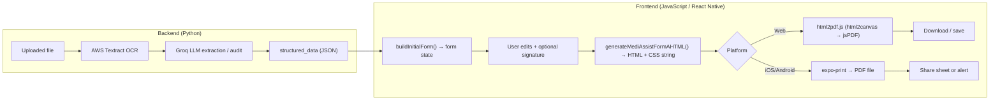

# Insurance claim form: end-to-end process

This document describes **how the insurance reimbursement claim form is produced**, **which languages and libraries are involved**, and **how it is turned into a downloadable PDF**—from uploaded document analysis through editing to export.

---

## 1. Big picture

The **printable form** is **not** a screenshot of the React Native UI. It is always generated from a **single HTML document string** built in JavaScript, then converted to PDF using **platform-specific** tools.

---

## 2. Languages and technologies

| Layer | Language / runtime | Role |
|--------|----------------------|------|
| **Claim analysis API** | **Python** (FastAPI) | Accepts upload, runs OCR + LLM pipeline, returns JSON (`structured_data`, reports, etc.). See `backend/medilocker_lambda/` — routes under `/medilocker/insurance/analyze`. |
| **Hospital download UI** | **JavaScript** (React Native + Expo) | Screen state, mapping extraction JSON → editable fields, preview, download trigger. |
| **Form layout for PDF** | **HTML + CSS** (as **strings** assembled in JS) | Full document with `<style>`, tables, character boxes—no JSX; produced by `generateMediAssistFormAHTML` in `MediAssistFormA.js`. |
| **Web PDF export** | **JavaScript** | **html2pdf.js** (uses **html2canvas** + **jsPDF**) rasterizes the DOM node and embeds it in a PDF. |
| **Native PDF export** | **JavaScript** | **expo-print** `Print.printToFileAsync({ html })`, then **expo-file-system** + **expo-sharing**. |

---

## 3. Phase A — Where the data comes from (backend, brief)

1. User uploads an insurance-related document (image or PDF) from the hospital insurance flow.
2. The MediLocker service runs a pipeline (LangGraph: OCR → field extraction → policy routing → audit → report). OCR uses **AWS Textract**; structured extraction and analysis use an **LLM** (e.g. via Groq) with prompts that define the JSON shape.
3. The API response includes **`structured_data`**: nested objects such as `patient_details`, `insurance_details`, `hospital_details`, `claim_details`, `bank_details`, etc.

For the **full backend graph**, models, and endpoints, see [`INSURANCE_CLAIM_COMPLETE_FLOW.md`](./INSURANCE_CLAIM_COMPLETE_FLOW.md).

**Important:** PDF generation **does not** call the backend again. It only serializes the **current in-app `form` object** (plus signature) into HTML.

---

## 4. Phase B — Building the editable form (frontend)

| Item | Location |
|------|----------|
| Screen | `frontend/screens/HospitalScreens/MediAssistFormA.jsx` |
| Navigation | e.g. from `HospitalInsuranceClaim.jsx` → `navigation.navigate("MediAssistFormA", { analysisData })` |
| Initial state | `route.params.analysisData` → `analysisData.structured_data` |

**`buildInitialForm(structured_data)`** (in `MediAssistFormA.jsx`) maps backend fields into a **flat `form` object** used by the screen: policy number, TPA/company ID, patient name and address, dates, amounts, gender, diagnosis, bank fields, etc. Helpers normalize text (uppercase, padding, date formats like DDMMYYYY, digit-only amounts).

The user can **edit** these fields and optionally capture an **e-signature** (stored as a **PNG data URI** in state, e.g. `signatureImage`).

---

## 5. Phase C — How the “insurance form” document is created (HTML)

| Item | Location |
|------|----------|
| Generator | `frontend/utils/MediAssistFormA.js` — **`generateMediAssistFormAHTML(form, signatureDataUrl)`** |

**Language:** pure **JavaScript** string concatenation and template literals. It returns one **complete HTML document** (`<!DOCTYPE html>`, `<head>`, `<body>`) with:

- Embedded **CSS** for A4-sized page dimensions (`INSURANCE_FORM_PAGE_WIDTH_PX` / `INSURANCE_FORM_PAGE_HEIGHT_PX`, 794×1123 px at 96 DPI—aligned with jsPDF on web).
- Root container class **`.ifr`** (Medi Assist–style header, sections A–H, reimbursement claim layout).
- **Table-based layout** (no flex/grid in the template) for predictable print rendering.
- **Character boxes** via small HTML tables (`charBoxHtml`), checkboxes, underlined fields (`tf`), optional **signature** block from the data URL.

The same function drives:

- **Preview on wide web:** `htmlPreview = generateMediAssistFormAHTML(form, signatureImage)` can be shown in an **`<iframe srcDoc={...}>`** so preview matches the PDF input.
- **Export:** identical HTML string is passed into the PDF step below.

---

## 6. Phase D — Conversion before download (PDF)

Entry point: **`downloadMediAssistFormA(form, signatureDataUrl)`** in `MediAssistFormA.js`.

1. **Filename:** `MediAssistFormA_InsuranceClaim_{primaryName}_{YYYY-MM-DD}.pdf` (`primaryName` from `form`, spaces → underscores).
2. **HTML:** `const html = generateMediAssistFormAHTML(form, signatureDataUrl)`.

### Web (`Platform.OS === "web"`)

1. Dynamically import **`html2pdf.js`**.
2. **Problem being solved:** html2pdf clones content into the **main** document; styles that only exist inside an iframe `srcDoc` do not apply, and `body { }` rules do not target a `div`. So the code:
   - Parses `html` with **`DOMParser`**.
   - Injects the template’s **`<style>`** text into **`document.head`** (marked `data-insurance-pdf-export`).
   - Appends an off-screen host `div` containing a clone of the **`.ifr`** root (or on-screen briefly if debug is enabled).
3. Waits for **`document.fonts.ready`** when available.
4. Calls **`html2pdf().set({...}).from(captureEl).save(fileName)`** with:
   - **html2canvas:** e.g. `scale: 2`, `useCORS: true`, `allowTaint: true`, white background.
   - **jsPDF:** `unit: "px"`, format matching the fixed page size, portrait, margin 0.
5. **Cleanup:** removes injected style and host nodes (or delayed cleanup in debug mode).

So on web the PDF is: **HTML/CSS → rendered DOM → raster (html2canvas) → PDF (jsPDF)**. It is a **bitmap** snapshot, not native vector text.

### Native (iOS / Android)

1. **`Print.printToFileAsync({ html })`** — Expo uses the **platform print pipeline** to turn the **same HTML string** into a PDF (no browser DOM).
2. Copy temp file to **`FileSystem.documentDirectory`** with the final filename; delete the temp URI when possible.
3. **`Sharing.shareAsync`** with `mimeType: application/pdf` (or an alert with the path if sharing is unavailable).

Native and web paths use **different rendering engines**, so tiny visual differences are possible even with identical HTML.

---

## 7. UI vs PDF (why they can look different)

- The **editable** UI is **React Native** (`View`, `TextInput`, custom rows). The **PDF** always comes from **`generateMediAssistFormAHTML`**, not from a React tree export.
- On **desktop web**, **Preview** (iframe with the same HTML) is the fair comparison to the PDF; **Edit** mode may diverge in spacing, fonts, and chrome.
- On **narrow web or native**, users often only see the RN form; field **values** match, but **layout** may differ from the PDF.

---

## 8. Quick reference — key files

| Concern | File |
|---------|------|
| Editable screen + `buildInitialForm` (Form A) | `frontend/screens/HospitalScreens/MediAssistFormA.jsx` |
| HTML template + `downloadMediAssistFormA` | `frontend/utils/MediAssistFormA.js` |
| Editable screen (Form B – hospital section) | `frontend/screens/HospitalScreens/MediAssistFormB.jsx` |
| HTML template + `downloadMediAssistFormB` | `frontend/utils/MediAssistFormB.js` |
| Insurance analyze API & pipeline | `backend/medilocker_lambda/app/routers/medilocker_router.py`, `claim_validator_graph.py` (see also `INSURANCE_CLAIM_COMPLETE_FLOW.md`) |
| Deeper PDF/web preview notes | [`INSURANCE_CLAIM_PDF_DOWNLOAD.md`](./INSURANCE_CLAIM_PDF_DOWNLOAD.md) |

---

## 10. Form B – hospital section (CLAIM FORM PART B)

| Item | Detail |
|------|--------|
| Screen | `frontend/screens/HospitalScreens/MediAssistFormB.jsx` — route `MediAssistFormB` |
| HTML template | `frontend/utils/MediAssistFormB.js` — `generateMediAssistFormBHTML` / `downloadMediAssistFormB` |
| Entry point | `HospitalInsuranceClaim.jsx` — green "Generate Form B (hospital) →" button (beside Form A CTA) |
| Initial state | **All fields blank.** `buildInitialFormB()` returns empty strings, `false`, and empty arrays. |
| Autofill | **TODO** — `buildInitialFormB(analysisData)` mapper is not yet implemented. Add it later using the same `applyAutofillResultToForm` pattern from Form A. |
| Sections | A (Hospital details), B (Patient admitted), C (Ailment/ICD/procedures/pre-auth/injury), D (Document checklist), E (Non-network hospital), F (Hospital declaration + signature) |
| PDF filename | `MediAssistFormB_HospitalClaim_{hospitalName}_{YYYY-MM-DD}.pdf` |

---

## 9. Summary

| Question | Answer |
|----------|--------|
| **How is the form “created”?** | Backend JSON is mapped to **`form`** state; **`generateMediAssistFormAHTML`** builds a full **HTML/CSS** document string (sections A–H, Medi Assist–style reimbursement form). |
| **Which language?** | **Python** for analysis; **JavaScript** for UI and string-built **HTML/CSS**; PDF via **JS libraries** (web) or **Expo** APIs (native). |
| **How is it converted before download?** | **Web:** HTML → DOM clone + injected styles → **html2canvas** → **jsPDF** → `.pdf` file. **Native:** same HTML string → **expo-print** → PDF file → share/save. |
