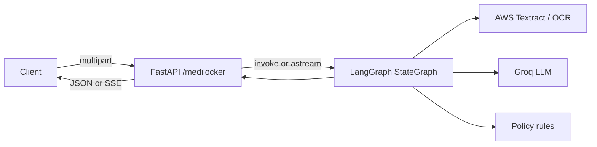

# LangGraph and FastAPI in this codebase

## Summary

**Yes — the backend uses [LangGraph](https://github.com/langchain-ai/langgraph)** (not a separate "LangRaph" product). It appears in **one place**: the **MediLocker** Lambda service, for the **insurance claim validation** pipeline. Other Python backends (chat, hospitals, auth, etc.) do **not** import `langgraph` in this repository.

| Area | Location |
|------|----------|
| Graph definition & execution | `backend/medilocker_lambda/app/services/claim_validator_graph.py` |
| FastAPI routes | `backend/medilocker_lambda/app/routers/medilocker_router.py` |
| App entry (FastAPI + Mangum for AWS Lambda) | `backend/medilocker_lambda/app/main.py` |
| Dependency | `backend/medilocker_lambda/requirements.txt` — `langgraph`, `langchain-core`, `fastapi`, `sse-starlette` |

For the **full node-by-node pipeline and models** (Textract, Groq, policy routing), see [INSURANCE_CLAIM_COMPLETE_FLOW.md](./INSURANCE_CLAIM_COMPLETE_FLOW.md).

---

## What the LangGraph does

A **`StateGraph`** is built on a **`ClaimValidationState`** `TypedDict` that holds inputs (`file_bytes`, `filename`), per-step outputs (OCR text, structured JSON, policy choice, audit, final report), and `error` / `timings`.

**Nodes (in order of the happy path):**

1. `ocr_extractor` — Textract (no LLM)  
2. `claim_field_extractor` — LLM: OCR text → structured JSON  
3. `policy_router` — rule-based baseline (`policy_router.py`; no LLM)  
4. `claim_auditor` — LLM: line-by-line audit  
5. `report_generator` — LLM: final report  

**Edges:** The graph uses `START` / `END` and **conditional edges** (e.g. after OCR, extraction, or audit) to short-circuit to `END` on failure, instead of always running all nodes.

The compiled graph is a **singleton**: `get_claim_validator()` calls `build_claim_validator_graph()` once and reuses the compiled object.

---

## How FastAPI uses it

The MediLocker app mounts the router with prefix **`/medilocker`** (see `main.py`). Insurance endpoints:

| Method & path | Behavior |
|---------------|----------|
| `POST /medilocker/insurance/analyze` | Multipart file upload. Reads bytes, calls `validate_claim(...)`, which runs **`graph.invoke(initial_state)`** and returns a JSON dict (structured data, policy info, audit, report, error, timings). **Synchronous** graph run inside an `async` route handler. |
| `POST /medilocker/insurance/analyze/stream` | Same upload. Uses **`EventSourceResponse`** from `sse-starlette`. An async generator calls **`validate_claim_streaming`**, which iterates **`graph.astream(initial_state, stream_mode="updates")`**. Each node completion becomes an SSE event with JSON `data`. A final `__done__` payload includes `total_time`. |

So: **FastAPI does not implement the workflow itself** — it only handles HTTP (multipart, JSON/SSE) and **delegates** to thin wrappers that invoke or stream the LangGraph.

---

## Diagram (high level)

---

## Related code (for navigation)

- **Graph build:** `build_claim_validator_graph()` — `StateGraph(ClaimValidationState)`, `add_node`, `add_edge`, `add_conditional_edges`, `compile()`.  
- **Non-streaming:** `validate_claim` → `graph.invoke(initial_state)`.  
- **Streaming:** `validate_claim_streaming` → `async for event in graph.astream(..., stream_mode="updates")`, then maps each node's output to an SSE payload.

Legacy **non-graph** insurance logic can still exist in `insurance_extraction_service.py`; the **documented production path** for the analyze endpoints above is the LangGraph pipeline.
