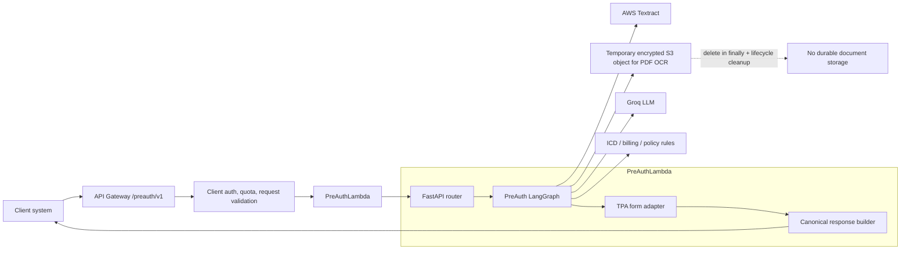
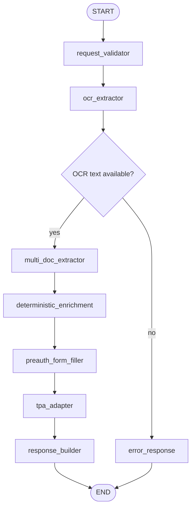

# Pre-Auth Service Architecture

## Executive summary

Pre-auth should be split out of `medilocker_lambda` into a dedicated, stateless B2B API. The current MediLocker insurance flow already contains two behaviors inside one endpoint:

- **Pre-auth / autofill:** runs when no `claim_form` is uploaded. It OCRs supporting documents, extracts patient / policy / diagnosis / billing data, and fills a pre-auth form.
- **Final auth / claim audit:** runs when `claim_form` is uploaded. It extracts the submitted claim form, compares supporting documents, audits issues, and builds a final report.

The new service should own only the pre-auth path. It should not require `user_id`, should not write rows to `MedilockerDocuments`, and should not store client documents durably. Clients send documents in a request, the service processes them transiently, returns structured pre-auth output, and deletes any temporary PDF OCR objects.

## Current state in this repo

| Area | Current implementation |
| ---- | ---------------------- |
| Combined route | `POST /medilocker/insurance/analyze` in `backend/medilocker_lambda/app/routers/medilocker_router.py` |
| Stored-doc pre-auth route | `POST /medilocker/users/{user_id}/insurance/autofill-stored` |
| Graph | `backend/medilocker_lambda/app/services/claim_validator_graph.py` |
| Pre-auth graph nodes | `ocr_extractor` -> `multi_doc_extractor` -> `claim_form_filler` |
| Final auth graph nodes | `ocr_extractor` -> `claim_field_extractor` -> `policy_router` -> `cross_doc_analyzer` -> `claim_auditor` |
| OCR | AWS Textract via `ocr_service.py`; PDFs are temporarily uploaded to S3 for Textract, then deleted |
| LLM | Groq OpenAI-compatible API using `CLAIM_VALIDATOR_MODEL` |
| Deterministic helpers | ICD lookup, billing amount parsing, policy routing |

The clean product boundary is therefore:

- **PreAuthLambda:** no claim form, no MediLocker storage, external client API.
- **MediLockerLambda final auth:** claim form present, Kokoro hospital UI and final claim audit.
- **MediLocker stored pre-auth:** can remain as an internal convenience endpoint, but should reuse the same pre-auth core logic.

## Target architecture



## Recommended service split

Create a new deployable unit:

```text
backend/
  preauth_lambda/
    requirements.txt
    app/
      main.py
      config.py
      logger.py
      routers/
        preauth_router.py
      services/
        preauth_graph.py
        preauth_response_service.py
        tpa_adapters/
          mediassist.py
          star_health.py
          care_health.py
      models/
        schemas.py
      auth/
        client_auth.py
```

Extract shared insurance primitives into a shared package or Lambda layer so `medilocker_lambda` and `preauth_lambda` do not drift:

```text
backend/
  insurance_core_layer/
    python/
      insurance_core/
        ocr.py
        icd_lookup.py
        policy_router.py
        billing.py
        prompts/
          preauth_prompts.py
```

For the first version, the fastest safe path is to duplicate only the minimal pre-auth modules into `preauth_lambda`, then refactor to `insurance_core_layer` once the API contract is accepted. For long-term maintenance, the shared layer is better.

## Pre-auth graph

The pre-auth service should have its own graph, not a branch hidden inside the final-auth graph.



Node responsibilities:

| Node | Responsibility | LLM? |
| ---- | -------------- | ---- |
| `request_validator` | Validate file count, size, MIME / extension, allowed document types, target TPA | No |
| `ocr_extractor` | OCR PDFs/images; delete temp S3 PDFs after Textract | No |
| `multi_doc_extractor` | Extract patient, hospital, policy, diagnosis, treatment, billing data from all OCR text | Yes |
| `deterministic_enrichment` | Verify ICD code, normalize dates/amounts, compute estimated bill/claimable amount | No |
| `preauth_form_filler` | Convert extracted data into canonical pre-auth fields | Yes or rules + LLM fallback |
| `tpa_adapter` | Map canonical fields into Medi Assist / Star Health / Care Health form schema | No |
| `response_builder` | Return stable public schema, evidence, timings, warnings | No |

## External API contract

Base path:

```text
/preauth/v1
```

### `POST /preauth/v1/analyze`

Synchronous stateless analysis for small to medium document sets.

Request: `multipart/form-data`

| Field | Type | Required | Notes |
| ----- | ---- | -------- | ----- |
| `insurance_policy` | file | No | Policy document/card |
| `hospital_bill` | file | No | Estimate, bill, package quote, admission note |
| `doctor_prescription` | file | No | Prescription or treatment advice |
| `discharge_summary` | file | No | Optional if available |
| `lab_report` | file | No | Optional supporting clinical evidence |
| `patient_intake` | string JSON | No | Optional client-provided demographics or hospital metadata |
| `target_tpa` | string | No | `mediassist`, `star_health`, `care_health`, or `auto` |
| `client_reference_id` | string | No | Client-side correlation id, never used as patient id |

Validation rule: at least one clinical/policy document or a meaningful `patient_intake` payload must be present.

Example:

```bash
curl -X POST "https://api.kokoro.doctor/preauth/v1/analyze" \
  -H "x-api-key: <client_api_key>" \
  -F "insurance_policy=@policy.pdf" \
  -F "hospital_bill=@estimate.pdf" \
  -F "doctor_prescription=@prescription.pdf" \
  -F "target_tpa=mediassist" \
  -F 'client_reference_id=HOSP123-PA-8821'
```

Response:

```json
{
  "request_id": "pa_01J...",
  "flow": "preauth",
  "status": "completed",
  "target_tpa": "mediassist",
  "documents_processed": ["insurance_policy", "hospital_bill", "doctor_prescription"],
  "preauth_extracted": {
    "patient": {},
    "policy": {},
    "hospital": {},
    "diagnosis_and_procedures": {},
    "billing": {}
  },
  "preauth_result": {
    "canonical_fields": {},
    "tpa_form_fields": {},
    "claimable_summary": {},
    "missing_fields": [],
    "warnings": []
  },
  "evidence": [
    {
      "field": "primary_diagnosis",
      "source_document": "doctor_prescription",
      "confidence": 0.86
    }
  ],
  "timings": {
    "ocr": 7.2,
    "multi_doc_extraction": 4.1,
    "form_filling": 2.3
  },
  "error": null
}
```

### `POST /preauth/v1/analyze/stream`

Same request as `analyze`, but returns Server-Sent Events for client UIs that want progress.

Events:

| Event | Payload |
| ----- | ------- |
| `request_validator` | accepted files and warnings |
| `ocr_extractor` | completed document types, OCR failures |
| `multi_doc_extractor` | extracted sections available |
| `deterministic_enrichment` | ICD/billing/policy enrichment complete |
| `preauth_form_filler` | canonical form data ready |
| `tpa_adapter` | TPA-specific mapped fields ready |
| `done` | final response |

### Optional async API

If large PDFs or many documents frequently exceed the HTTP response window, add:

```text
POST /preauth/v1/jobs
GET  /preauth/v1/jobs/{request_id}
```

The async version can store only job metadata and output with short TTL. It still should not store raw documents unless a specific enterprise client signs a separate retention agreement.

## "We do not store your documents" contract

The public claim should be precise:

> Kokoro processes documents transiently to generate the pre-auth response. We do not create MediLocker records, do not store client documents durably, and delete temporary OCR objects after processing. Operational logs contain request metadata only, not document text or files.

Implementation requirements:

- Do not accept `user_id` for public pre-auth APIs.
- Do not write to `MedilockerDocuments`, `Users`, or patient-linked DynamoDB tables.
- Do not save original files or OCR text to durable storage.
- For PDF Textract, write only to a dedicated temp S3 prefix such as `PreAuthTemp/{request_id}/...`.
- Use S3 server-side encryption on temp objects.
- Delete temp S3 objects in a `finally` block after OCR.
- Add S3 lifecycle expiration on the temp prefix as a safety net.
- Disable logging of OCR text, extracted PHI, base64 payloads, and LLM prompts.
- Store only minimal audit metadata if needed: `request_id`, `client_id`, timestamps, status, file count, timing, error class, token usage.
- Make debug retention opt-in and disabled by default: `PREAUTH_RETAIN_DEBUG=false`.

Important wording: clients still transmit documents to Kokoro for processing. If a client cannot transmit documents at all, they need an on-prem/VPC deployment or a client-hosted inference model, not the hosted API.

## Authentication and client management

Recommended B2B auth path:

1. **Phase 1:** API Gateway API keys + usage plans for fast launch.
2. **Phase 2:** OAuth2 client credentials or signed JWT per client.
3. **Phase 3:** Optional mTLS for enterprise integrations.

Required controls:

- Per-client quota and rate limits.
- `x-client-id` or JWT `client_id` claim in every request.
- `Idempotency-Key` support for retries.
- WAF rules for payload abuse.
- Max file size and max document count per request.
- Secrets stored in AWS Secrets Manager or API Gateway, not hardcoded in SAM.

## Deployment changes

Add a new SAM function:

```yaml
PreAuthLambda:
  Type: AWS::Serverless::Function
  Properties:
    FunctionName: PreAuthLambda
    Handler: app.main.handler
    Runtime: python3.11
    MemorySize: 1024
    Timeout: 120
    CodeUri: ./preauth_lambda/
    Layers:
      - !Ref OCRCoreLayer
      # - !Ref InsuranceCoreLayer
    Environment:
      Variables:
        S3_BUCKET: kokoro-doctor
        PREAUTH_TEMP_PREFIX: PreAuthTemp/
        GROQ_API_KEY: "{{resolve:secretsmanager:preauth/groq:SecretString:GROQ_API_KEY}}"
        CLAIM_VALIDATOR_MODEL: meta-llama/llama-4-scout-17b-16e-instruct
        PREAUTH_RETAIN_DEBUG: "false"
```

Add API Gateway route:

```text
/preauth/{proxy+} -> PreAuthLambda
```

Add Lambda permission:

```text
arn:aws:execute-api:${Region}:${AccountId}:${ApiGateway}/*/*/preauth/*
```

Use a dedicated IAM role for this Lambda when possible. It should need only:

- CloudWatch Logs write.
- Textract OCR permissions.
- S3 put/get/delete/list on the temp prefix only.
- Secrets Manager read for LLM/API credentials.
- No broad DynamoDB access for the stateless version.

## Internal Kokoro flows after split

| Flow | Recommended owner | Notes |
| ---- | ----------------- | ----- |
| Hospital final claim audit | `medilocker_lambda` | Keep `/medilocker/insurance/analyze` for claim-form audit. |
| Hospital pre-auth from uploaded patient docs | `medilocker_lambda` route or new internal call to pre-auth core | It can keep using precomputed OCR, but should call shared pre-auth core logic. |
| External client pre-auth API | `preauth_lambda` | Stateless, no patient identity, no durable document storage. |
| Frontend pre-auth direct upload | Move to `/preauth/v1/analyze` | Avoids mixed pre-auth/final-auth behavior in one endpoint. |

## Migration plan

### Phase 0: lock the contract

- Freeze the public response schema around `preauth_extracted`, `preauth_result`, `evidence`, `warnings`, and `timings`.
- Decide first supported `target_tpa` values. Medi Assist can be first because the current graph filler already maps in that direction.
- Update stale docs that still describe `/medilocker/insurance/analyze` as a single `file` field.

### Phase 1: isolate pre-auth logic

- Add a `validate_preauth(documents, filenames, target_tpa="auto", patient_intake=None)` function.
- Move or copy only pre-auth nodes: OCR, multi-doc extraction, deterministic enrichment, form filling.
- Add unit tests for "no claim form" behavior so final-auth code cannot accidentally leak into pre-auth.

### Phase 2: scaffold `preauth_lambda`

- Create FastAPI + Mangum app with `/preauth/v1/analyze` and `/preauth/v1/analyze/stream`.
- Add request validation, API-key auth hook, file limits, and scrubbed logging.
- Add SAM resources and API Gateway path.

### Phase 3: route clients and frontend

- External clients integrate with `/preauth/v1/analyze`.
- Kokoro frontend direct pre-auth upload switches from `/medilocker/insurance/analyze` to `/preauth/v1/analyze`.
- Stored-doc pre-auth can remain on `/medilocker/users/{user_id}/insurance/autofill-stored`, but internally it should reuse the same core extraction/fill code.

### Phase 4: harden for production

- Add per-client usage plans, dashboards, alarms, and cost tracking.
- Add S3 lifecycle policy for `PreAuthTemp/`.
- Add redaction tests for logs.
- Add async job API if sync requests hit timeout often.
- Add per-client data processing agreement language that matches the actual no-durable-storage implementation.

## Open decisions

- Should the first public response be Medi Assist only, or canonical plus Medi Assist adapter?
- Do clients need generated PDF output, or only JSON fields for their own forms?
- Should request output be retained for any time period, or should the API remain zero-retention apart from operational metadata?
- Do enterprise clients require mTLS or is API key/OAuth acceptable for launch?
- Should Kokoro expose one regional endpoint only, or separate sandbox and production base URLs?

## Recommendation

Build `preauth_lambda` as a separate stateless Lambda with its own pre-auth LangGraph. Keep `medilocker_lambda` for MediLocker storage, stored-patient workflows, and final claim audit. Share OCR, prompts, ICD lookup, policy routing, and form adapters through a common `insurance_core` package or layer so the two services do not diverge.

This gives management the product story they want:

- Pre-auth is a standalone API product.
- Client documents are processed transiently and not stored as MediLocker records.
- Final auth remains separate and can evolve without affecting external pre-auth clients.
